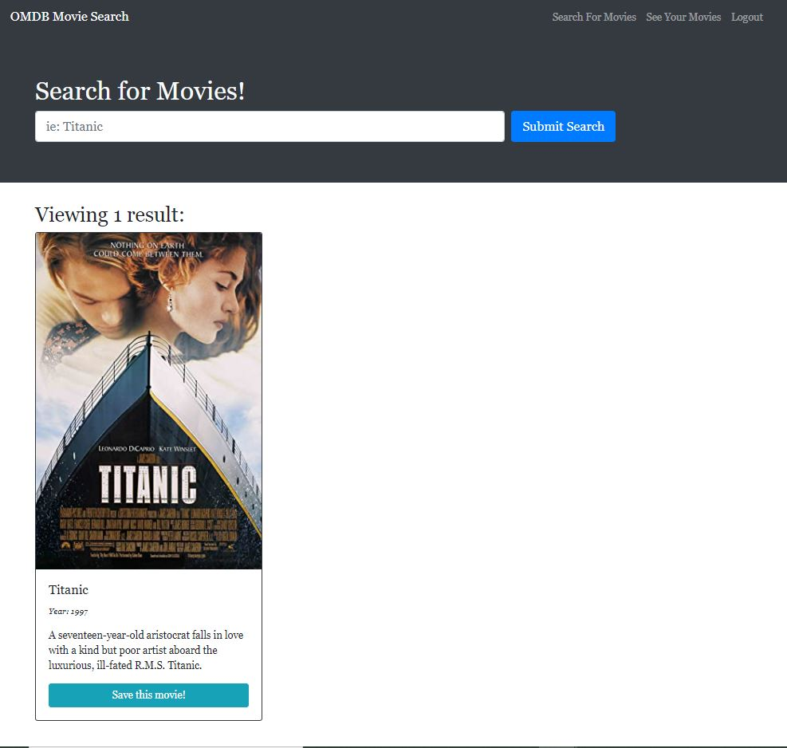

# OMDB Movie Search

## Purpose
To create an application that provides a "Search and Save" for various movies using OMDB API utilizing an Appolo server and GraphQL in lieu of RESTful APIs.

## Features
When the user loads the server, they are presented with a search bar where they can enter in a movie title. When the user signs up or logs in to their profile, they are able to add the movies that they have searched to a nomination list. They can also remove any movies that they no longer think should be nominated.

## Built With
* React JS
* JavaScript
* Apollo
* GraphQL
* Heroku
* Node JS 
* NoSQL - MongoDB
* Express
* Mongoose
* Concurrently

## Usage
To run program: node server

## Deployed Application
https://movie-magic-2021.herokuapp.com/

## Project Status
This OMDB Movie Search is complete in adherence with acceptance criteria

## Contribution
Created by Jennifer Mulder
